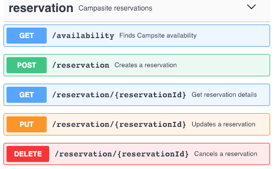

# Upgrade: coding challenge

Author: Sergio Vaquero

## Topic: Campsite

## Overview

This is an API REST backend service to manage the campsite reservations.

Here the API REST specification:

## Technology

This server runs on:
- Java 8
- Maven 3
- Spring Boot 2
- MongoDB 4

The API REST was designed with [Swagger Editor](https://editor.swagger.io/)

This server was initially generated with [swagger-codegen](https://github.com/swagger-api/swagger-codegen) (exported from the editor).

Start your server as an simple java application.

You can view the API documentation in Swagger-UI by pointing to  
http://localhost:8080/

## Why each piece of technology?

### Spring, Maven, Java

It was a suggestion from the client. This service is designed to work with a single or multiple instances, all of them sharing a unique database endpoint.

### MongoDB

One of the requirements is: _the system should be able to handle large volume of requests_. I think MongoDB is suitable for that case because of its high availability, even because it allows distributed instances.

Other requirement is: _the island is big enough to host a single campsite_. To offer high availability with multiple Java instances, this constraint is managed by the database (which is only one) with a unique index over the reservation dates.

## Unit tests

There are some unit test cases for the APIs: availability and reservations. Also there is a concurrency test case to check the campsite capacity constraint over concurrent requests.

## Resources

- **Swagger:** `/swagger/swagger.json` file for [Swagger Editor](https://editor.swagger.io/)
- **Postman:** `/postman/Upgrade-CC-1.postman_collection.json` file to test with Postman